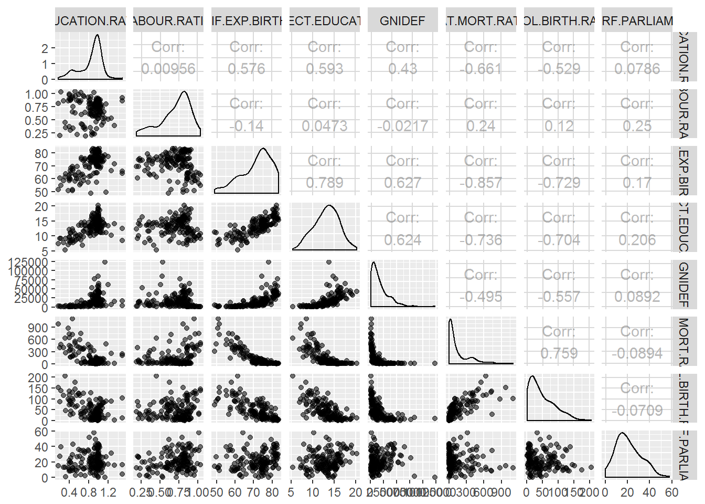
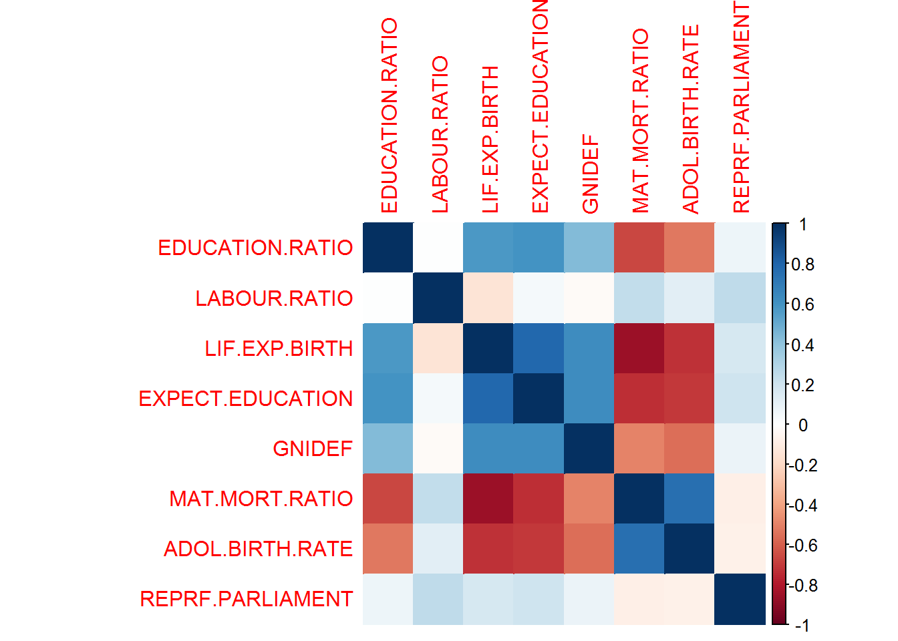
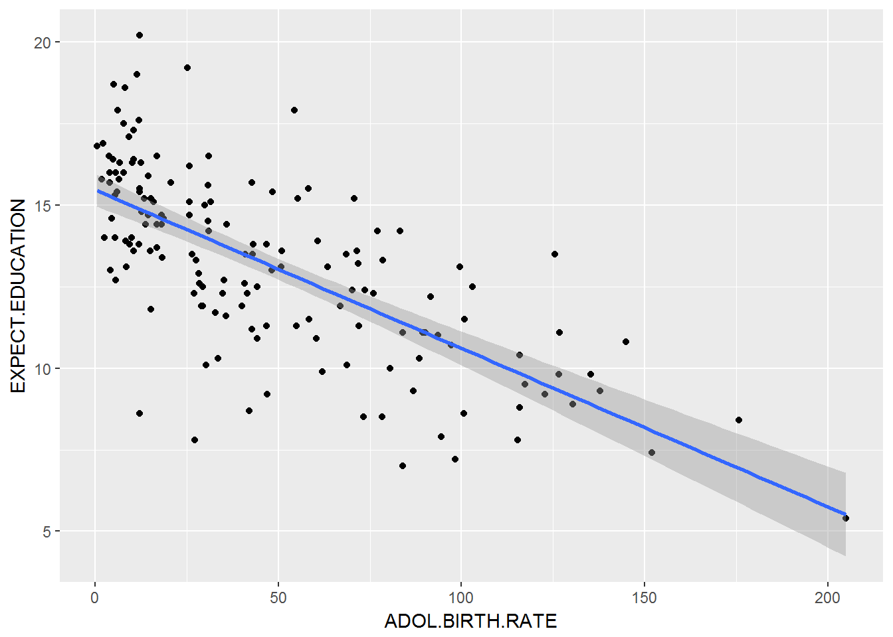
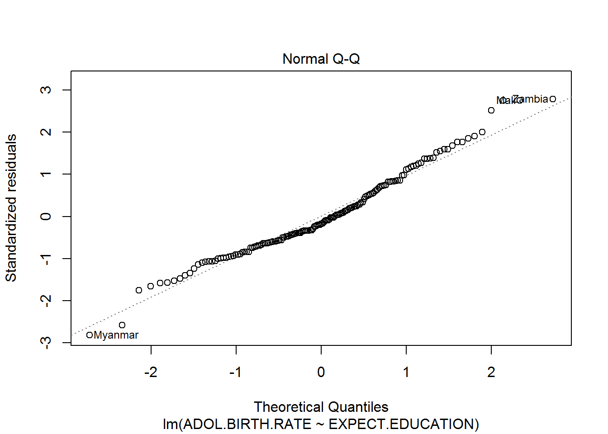
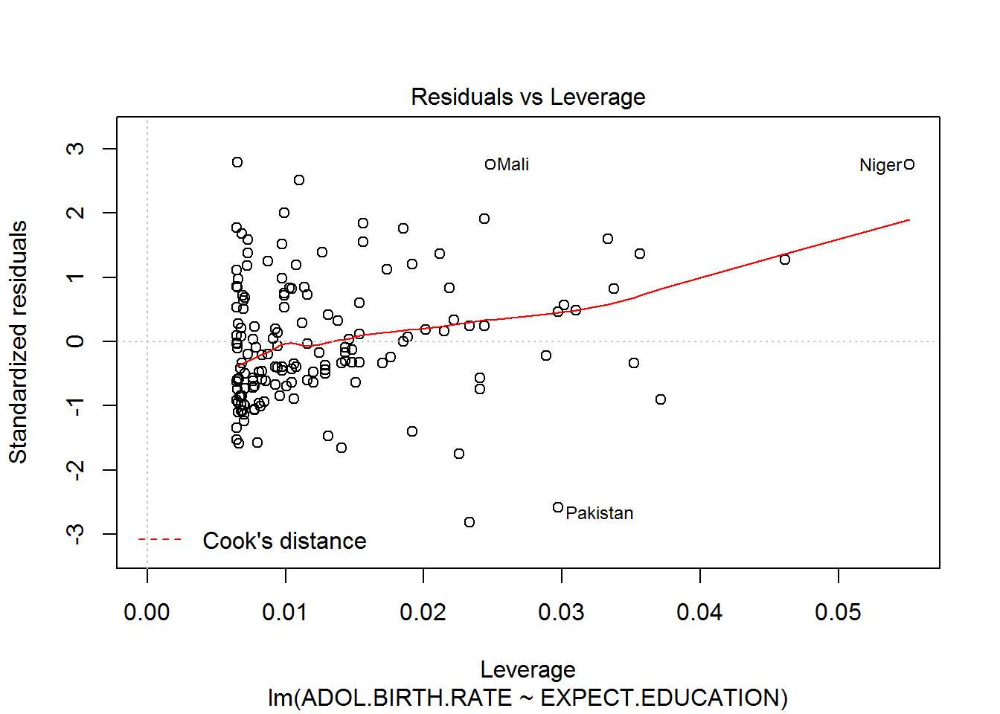

#ABSTRACT
In this exersice I address an interesting dataset which measures relevant variables in terms of human development. I graphically explore the information and analyse it by using a linear regressional model that will be tested for proving its validity.

#RESEARCH QUESTION 
I will address the relationship between the adolescent birth rate and the expected years of education. Hypothetically places where expected years of education are high have lower rates of adolescent birth rate.

#1. Data wrangling script: https://github.com/agtorresmora/IODS-final/blob/master/create_human.R

#. DATA DESCRIPTION
The data set has information obtained by the United Nations Development Program (UNDP) on various relevant topics of Human development such as Education, labour, political participation, mortality and the like. The data set contains 8 variables and 155 observations. "Gender inequality" (EDUCATION.RATIO and LABOUR.RATIO) variables have been created from original variables that discriminate male and female participation in education and working force. I focus on observations related to countries rather than regions

#Variables:
1. EDUCATION.RATIO: Ratio of female participation in secondary education with respect to male participation
2. LABOUR RATIO: Ratio of female participation in working force with respect to male participation
3. LIF.EXP.BIRTH: Life expectancy at birth
4. EXPECT.EDUCATION: Expected years of education
5. GNIDEF: Gross National Income
6. MAT.MORT.RATIO: Maternal morality ratio
7. ADOL.BIRTH.RATE: Rate of adolescent birth
8. REPRF.PARLIAMENT: female participation in the parliament


```r
library(ggplot2)
```

```
## Warning: package 'ggplot2' was built under R version 3.4.3
```

```r
library(dplyr)
```

```
## 
## Attaching package: 'dplyr'
```

```
## The following objects are masked from 'package:stats':
## 
##     filter, lag
```

```
## The following objects are masked from 'package:base':
## 
##     intersect, setdiff, setequal, union
```

```r
library(GGally)
```

```
## Warning: package 'GGally' was built under R version 3.4.3
```

```
## 
## Attaching package: 'GGally'
```

```
## The following object is masked from 'package:dplyr':
## 
##     nasa
```

```r
library(corrplot)
```

```
## Warning: package 'corrplot' was built under R version 3.4.3
```

```
## corrplot 0.84 loaded
```

# Reading the dataset

```r
human <- read.csv("~/GitHub/-IODS-final/IODS-final/human_.csv", header = TRUE, sep= ",")
```

# Exploring the dataset


```r
str(human)
```

```
## 'data.frame':	155 obs. of  8 variables:
##  $ EDUCATION.RATIO : num  1.007 0.997 0.983 0.989 0.969 ...
##  $ LABOUR.RATIO    : num  0.891 0.819 0.825 0.884 0.829 ...
##  $ LIF.EXP.BIRTH   : num  81.6 82.4 83 80.2 81.6 80.9 80.9 79.1 82 81.8 ...
##  $ EXPECT.EDUCATION: num  17.5 20.2 15.8 18.7 17.9 16.5 18.6 16.5 15.9 19.2 ...
##  $ GNIDEF          : int  64992 42261 56431 44025 45435 43919 39568 52947 42155 32689 ...
##  $ MAT.MORT.RATIO  : int  4 6 6 5 6 7 9 28 11 8 ...
##  $ ADOL.BIRTH.RATE : num  7.8 12.1 1.9 5.1 6.2 3.8 8.2 31 14.5 25.3 ...
##  $ REPRF.PARLIAMENT: num  39.6 30.5 28.5 38 36.9 36.9 19.9 19.4 28.2 31.4 ...
```

```r
dim(human)
```

```
## [1] 155   8
```

# GRAPHICAL OVERVIEW OF THE DATASET
Pair overview:

```r
Graph1 <- ggpairs(human, mapping = aes( alpha = 0.7), lower = list(combo = wrap("facethist", bins = 20)))
Graph1
```


The graph is useful for stating correlations between variables. The closer the figure is to 1 the higher the correlation is and the closer to 0 the lowest it is. For example, Maternal mortality ratio is also highly correlated to adolescent birth rate(0.759). This confirms the studies that suggest that the places where women are more likely to die when giving a birth also perform badly in terms of social policies for preventing adolescent pregnancy.

Correlating:

```r
cor_matrix<-cor(human)
cor_matrix %>% round(digits=2)
```

```
##                  EDUCATION.RATIO LABOUR.RATIO LIF.EXP.BIRTH
## EDUCATION.RATIO             1.00         0.01          0.58
## LABOUR.RATIO                0.01         1.00         -0.14
## LIF.EXP.BIRTH               0.58        -0.14          1.00
## EXPECT.EDUCATION            0.59         0.05          0.79
## GNIDEF                      0.43        -0.02          0.63
## MAT.MORT.RATIO             -0.66         0.24         -0.86
## ADOL.BIRTH.RATE            -0.53         0.12         -0.73
## REPRF.PARLIAMENT            0.08         0.25          0.17
##                  EXPECT.EDUCATION GNIDEF MAT.MORT.RATIO ADOL.BIRTH.RATE
## EDUCATION.RATIO              0.59   0.43          -0.66           -0.53
## LABOUR.RATIO                 0.05  -0.02           0.24            0.12
## LIF.EXP.BIRTH                0.79   0.63          -0.86           -0.73
## EXPECT.EDUCATION             1.00   0.62          -0.74           -0.70
## GNIDEF                       0.62   1.00          -0.50           -0.56
## MAT.MORT.RATIO              -0.74  -0.50           1.00            0.76
## ADOL.BIRTH.RATE             -0.70  -0.56           0.76            1.00
## REPRF.PARLIAMENT             0.21   0.09          -0.09           -0.07
##                  REPRF.PARLIAMENT
## EDUCATION.RATIO              0.08
## LABOUR.RATIO                 0.25
## LIF.EXP.BIRTH                0.17
## EXPECT.EDUCATION             0.21
## GNIDEF                       0.09
## MAT.MORT.RATIO              -0.09
## ADOL.BIRTH.RATE             -0.07
## REPRF.PARLIAMENT             1.00
```

Ploting the correlation:

```r
corrplot(cor_matrix,method="color")
```


The darker blue the relation, the higher the correlation. This graph confirms the high correlation between Maternal mortality ratio and adolescent birth rate. Additionally, those places with the higher mortality ratio are negatively correlated to life expectancy at birth. This confirms the widely accepted fact according to which places where more women die while giving a birth have low expectancy at birth.

A previous regression:

```r
qplot(ADOL.BIRTH.RATE, EXPECT.EDUCATION, data = human) + geom_smooth(method = "lm")
```


As expected, countries with high levels of education have lower rates of adolescent births. Let´s go deeper by means of a linear regression analysis.

#THE METHOD
Linear regression:
I will do a linear regression using Adolescent birth rate as the target variable and Expected education as the explanatory one. In this model I assume that: 1. Adolescent birth rate is modelled as a combinations of the rest of parameters; 2, there is no correlation in errors, which are normally distributed and whose variance is constant.


```r
par(mfrow = c(2,2))
Regression1 <- lm(ADOL.BIRTH.RATE ~ EXPECT.EDUCATION, data = human)
summary(Regression1)
```

```
## 
## Call:
## lm(formula = ADOL.BIRTH.RATE ~ EXPECT.EDUCATION, data = human)
## 
## Residuals:
##     Min      1Q  Median      3Q     Max 
## -81.662 -18.524  -5.145  19.278  81.540 
## 
## Coefficients:
##                  Estimate Std. Error t value Pr(>|t|)    
## (Intercept)      181.3439    11.2073   16.18   <2e-16 ***
## EXPECT.EDUCATION -10.1840     0.8316  -12.25   <2e-16 ***
## ---
## Signif. codes:  0 '***' 0.001 '**' 0.01 '*' 0.05 '.' 0.1 ' ' 1
## 
## Residual standard error: 29.31 on 153 degrees of freedom
## Multiple R-squared:  0.495,	Adjusted R-squared:  0.4917 
## F-statistic:   150 on 1 and 153 DF,  p-value: < 2.2e-16
```
In this model Expected years of education intercepts the y axis at 181.343 and the slope is = to -10.18. The Multiple R-squared is the proportion of the variance in the dataset. R-squared will be latter complemented with the residual plots for testing the model.


Testing the regression model:
# In order to test the model let´s use first the Normal QQ analysis.


```r
plot(Regression1, which = c(2))
```



According to Normal QQ-polt the linear model has errors normally distributed, so satisfying one of the previous assumptions

Let´s now use the residuals vs leverage analysis

```r
plot(Regression1, which = c(5))
```



The graph shows that errors are below 0.5 and even most of them are below 0.2, which allows one to trust the model.

#CONCLUSIONS
In this exercise I have addressed an interesting dataset on Human Development issued by UN, showing correlation between different variables. I focused on analysing the interaction between Adolescent birth rates and expected years of education finding a negative correlation between the two variables (countries with lower average education have higher rates of adolescent births). This was studied by means of a linear regression model which demonstrated to be convenient after its testing by using quantiles and leverage vs residuals.
